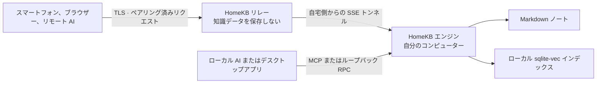

# HomeKB

自分のコンピューターに置いたまま、ローカルからも外出先からも AI が使える個人向け Markdown ナレッジベースです。

- **ファイルが中心。** ノートは、自分で管理するフォルダー内の通常の `.md` ファイルのままです。
- **Agent ネイティブ。** Claude Code、Codex、Claude、ChatGPT、そのほかの MCP クライアントがノートを検索・閲覧・作成・更新・共有できます。
- **設計そのものがローカルファースト。** インデックス、検索、書き込みは自宅のコンピューターに置き、AI 呼び出しには自分で設定したプロバイダーだけを使います。
- **アカウント不要のリモートアクセス。** 1 回限りのコードでペアリングし、リレーが保存するのは関係情報とトークンハッシュだけです。ナレッジベースの内容は保存しません。
- **2 つのコマンドでスマートフォンへ。** エンジンをインストールし、`homekb pair` を実行したら、Web UI で設定を完了できます。

[English](README.md) · [简体中文](README.zh-CN.md) · [日本語](README.ja.md)

---

## 知識は、自宅のコンピューターに

HomeKB は Markdown フォルダーをセマンティックなナレッジベースに変換します。データの所有権をクラウドアプリへ移す必要はありません。

ノートを `~/.homekb/notes/` に置くか、既存の Markdown フォルダーを指定すると、Rust エンジンがローカルの sqlite-vec インデックスを差分更新します。その後は、意味による検索、引用付きの質問応答、ノートの編集、MCP 経由での AI Agent 利用が可能になります。

製品の中核はコマンドラインエンジンです。デスクトップアプリと Web UI は同じ RPC 契約を使うレンダラーであり、リレーは外部クライアントと自宅で動くエンジンを結ぶパイプにすぎません。

---

## できること

- Markdown から要約、チャンク、文書タイプ、質問候補、埋め込みを生成。
- 文書要約とチャンクの 2 つの KNN プールを検索し、RRF で統合。
- top-K ではなくカテゴリー全体の網羅が必要な質問では、カテゴリー列挙へ切り替え。
- ローカルノートだけを根拠に、出典付きで質問へ回答。
- CLI または MCP からノートを作成、閲覧、更新、一覧表示、セマンティック検索。
- 未公開の下書きを自宅のコンピューターに保存し、ペアリング済みクライアント間で共有。
- デスクトップと Web UI で Markdown とローカル画像を表示し、貼り付け・ドラッグ＆ドロップによる画像追加とノート編集に対応。
- 単一ノートの公開リンクを作成し、パスワード、期限、即時失効を設定可能。
- Web UI から定期コンパイルを管理し、インデックス全体の再構築を開始可能。
- 自宅側から開始するトンネルでブラウザーや AI クライアントを接続。自宅に公開 IP は不要。

---

## 仕組み



HomeKB は、独立してデプロイできる 3 つの要素で構成されます。

| 要素                    | 役割                                                                              |
| --------------------- | ------------------------------------------------------------------------------- |
| **エンジン**（`engine/`）   | コンパイル、検索、Q&A、ローカル MCP、ローカル HTTP RPC、共有、ペアリング、トンネルを担う自己完結型 Rust CLI。             |
| **クライアント**（`client/`） | 1 つの Next.js UI を 2 つの形で提供。純粋な Web フロントエンドと、ローカルエンジンを導入・接続する Tauri デスクトップレンダラー。 |
| **リレー**（`relay/`）     | Cloudflare Workers 版と Node 版を同じ契約で提供。RPC、ストリーム、バイナリアセットを転送し、ナレッジベースの内容は保存しない。   |

プロトコルとデータ配置の正本は [docs/ARCHITECTURE.md](docs/ARCHITECTURE.md) です。

---

## クイックスタート

エンジンは**単一の自己完結型バイナリ**です。SQLite と rustls TLS を内蔵し、実行時依存関係も Rust ツールチェーンも必要ありません。

### 1. エンジンをインストール

```bash
# macOS / Linux — Homebrew
brew install do-md/tap/homekb

# macOS / Linux — インストールスクリプト
curl -fsSL https://raw.githubusercontent.com/do-md/homekb/main/install.sh | sh

# Windows — Scoop
scoop bucket add homekb https://github.com/do-md/scoop-bucket
scoop install homekb
```

[最新の Release](https://github.com/do-md/homekb/releases)からバイナリを直接ダウンロードすることもできます。ソースからビルドする場合は、リポジトリ内で `cd engine && cargo install --path cli` を実行してください。新しい Rust ツールチェーンが必要です。

インストールスクリプトはバイナリを `~/.local/bin` に配置し、そのディレクトリを shell の `PATH` に自動追加します（zsh・bash・fish 対応）。新しいターミナルを開く——または shell の rc ファイルを `source` する——と `homekb` が認識されます。

### 2. このコンピューターをペアリング

```bash
homekb pair
```

初回実行時は、このコンピューターを HomeKB 組み込みの公式接続サービスへ登録します。macOS ではバックグラウンド接続と定期コンパイルのサービスも起動し、最後に 10 分間有効な 1 回限りのコードを表示します。HomeKB アカウントは作成されません。

バックグラウンドサービスの自動インストールは現在 macOS のみ対応しています。Linux と Windows については[現在の状態](#現在の状態)を参照してください。

### 3. Web UI を開く

スマートフォンまたは別のブラウザーで [www.homekb.app](https://www.homekb.app) を開き、コードを入力します。既定の接続先はあらかじめ選択されているため、アドレスの入力は不要です。

### 4. ブラウザーで設定を完了

- **Settings** を開き、必須の **Embedding** と **Summary** を設定します。MCP で接続する Agent は自身のモデルを使うため、**Ask** は任意です。
- OpenAI、Gemini、Voyage、Cohere、DeepSeek、Qwen のプリセット、または OpenAI 互換のカスタムエンドポイントを選べます。
- **Status** で最初のコンパイルを確認します。macOS では初回ペアリング後に定期コンパイルが既定で有効になり、ここから一時停止や間隔変更ができます。

Markdown ファイルは自宅のコンピューターに置いたまま、ペアリングしたブラウザーからナレッジベースを検索・閲覧・編集・管理できます。

---

## macOS デスクトップアプリ

ナレッジベースを置く Mac でネイティブウィンドウを使いたい場合は、[最新版の HomeKB デスクトップアプリをダウンロード](https://github.com/do-md/homekb/releases/latest/download/HomeKB_aarch64.dmg)できます。現在のデスクトップ版は Apple Silicon Mac に対応しています。Engine と Web UI は引き続き主要なクロスプラットフォーム利用経路です。

デスクトップアプリは、同じローカル Engine と UI を使うネイティブシェルです。

- Homebrew、インストールスクリプト、または対応する場所に HomeKB Engine がすでにある場合は、自動的に検出して再利用し、重複してインストールしません。
- Engine が見つからない場合は、最新の互換バージョンを自動的にダウンロードし、ローカルへインストールして起動します。
- アプリ本体は組み込みアップデーターで更新され、Engine の更新は **Settings** から個別に確認・インストールできます。

デスクトップアプリ、CLI、Web UI のどれを使っても、ノート、インデックス、AI 認証情報は同じローカル HomeKB ディレクトリに保存されます。

---

## CLI から使う

ブラウザー中心の手順では手動初期化は不要です。ターミナルでプロバイダーを設定する場合や、既存の Markdown ディレクトリを使う場合に `homekb init` を実行します。

```bash
homekb init --notes "$HOME/Documents/notes" --openai-key "$OPENAI_API_KEY"
homekb reindex
homekb query "ローカルファーストな保存について、以前どんな判断をした？"
homekb ask "ローカルファーストな保存に関するノートを要約して。"
```

`--notes` を省略すると `~/.homekb/notes/` を使用します。`homekb init` はデータディレクトリと `~/.homekb/config.toml` を作成します。Web UI と同じプロバイダープリセットを設定ファイルからも利用できます。詳しくは [AI プロバイダー設定](docs/ARCHITECTURE.md#ai-provider-presets)を参照してください。

macOS でコンパイルをバックグラウンド実行するには：

```bash
homekb watch --install --interval 300
```

アプリの **Status** ページからも定期コンパイルの有効化、一時停止、間隔変更ができます。Linux と Windows では、現時点ではプロセスマネージャーから `homekb watch` を実行してください。

---

## AI を接続

HomeKB はすべての MCP クライアントに同じツールを公開します。

`kb_search` · `kb_read` · `kb_create` · `kb_update` · `kb_list` · `kb_status` · `kb_share`

1 つのコマンドで Claude Code と Codex（インストール済みのもの）に登録できます。

```bash
homekb mcp --install
```

値を渡すと対象を絞れます（`homekb mcp --install claude` / `codex`）。`homekb mcp --uninstall` で登録を解除します。エンジンは自身の絶対パスで登録するため、agent の PATH に `~/.local/bin` がなくても接続できます——素の `homekb` コマンドを手動登録すると、原因のわかりにくい「Failed to connect」になりがちです。

このローカル MCP サーバーは stdio で動作し、エンジンを直接呼び出します。接続サービスは経由しません。

別のデバイス上の Claude または ChatGPT から使う場合は、公式のリモート MCP エンドポイントをカスタムコネクターとして追加します。

```text
https://homekb-relay.wangjintaoapp.workers.dev/api/mcp
```

`homekb pair` でコードを生成し、コネクターの OAuth 認可画面に入力してください。同じ 1 回限りのコードでブラウザーと AI クライアントをペアリングでき、10 分後に失効します。接続サービスも自分で運用したい場合は、[接続サービスをセルフホスト](#接続サービスをセルフホスト)を参照してください。

---

## データと信頼モデル

| データ        | 保存場所                                                      |
| ---------- | --------------------------------------------------------- |
| ノート        | `~/.homekb/notes/`、または設定した任意の Markdown ディレクトリ。            |
| 下書きとアセット   | `~/.homekb/drafts/` と `~/.homekb/assets/`。                |
| 検索スナップショット | `~/.homekb/index/index.db`。クラウドドライブ同期に適した単一ファイル。          |
| 作業データベース   | OS のアプリケーションデータ領域。クラウド同期による WAL 破損を避けるため、データルートの外に配置。     |
| 設定と AI キー  | `~/.homekb/config.toml`。データルート全体を同期する場合は、このファイルを除外してください。 |
| リレーの状態     | ペアリング関係、共有ルーティング、SHA-256 トークンハッシュ。ノートやインデックスは含まれません。      |

次の 2 つの境界は明確にしておく必要があります。

- **保存時：**リレーはノート、添付ファイル、検索結果、インデックスを保存しません。自宅のコンピューターが常に唯一の正本です。
- **転送時：**リモートリクエストは TLS 終端後にリレーのメモリを通過します。埋め込み、要約、回答に使うテキストは、設定した AI プロバイダーへ到達します。現在のプロトコルはエンドツーエンド暗号化ではありません。リレーをセルフホストすれば HomeKB 運営者を信頼経路から外せますが、自分で選んだ AI プロバイダーまで外すことはできません。

既定の設定では HomeKB の公式ホスト型リレーを使い、ナレッジベースのデータはそこへ保存されません。[接続サービスをセルフホスト](#接続サービスをセルフホスト)すれば、その運営者もリモートリクエストの経路から完全に外せます。

完全な説明は[リレーの信頼境界](docs/ARCHITECTURE.md#relay-trust-boundary)を参照してください。

---

## エンジンコマンド

HomeKB は Git のようなサブコマンド方式です。REPL もクライアント依存もありません。

```text
homekb init       データツリーと設定を作成
homekb reindex    変更されたノートを差分コンパイル
homekb watch      定期的な差分コンパイルを実行
homekb query      セマンティック検索
homekb ask        ライブラリを根拠に引用付きで回答
homekb new        Markdown ノートを作成
homekb status     インデックスの状態を確認
homekb rebuild    新しい埋め込み空間向けに再構築
homekb mcp        stdio でローカル MCP を提供
homekb serve      ローカル HTTP RPC とアセットを提供
homekb register   接続サービスへ登録
homekb pair       初回は既定の接続を設定し、その後 1 回限りのコードを生成
homekb share      公開ノートリンクを作成・一覧・失効
homekb tunnel     自宅とリレーの接続を維持
homekb start      このマシンでバックグラウンドサービスを開始
homekb stop       バックグラウンドサービスを一時停止（可逆・何も削除しない）
homekb uninstall  このマシンからエンジンを削除——ノートには一切触れない
```

完全なオプションは `homekb <command> --help` で確認できます。

macOS では、`homekb watch --install` が管理する定期コンパイルサービスと、アプリの **Status** ページに表示されるサービスは同じものです。どちらからでも有効化や間隔変更ができます。

### エンジンの一時停止・削除

エンジンがマシンに残す痕跡を、段階的な 3 つのコマンドで管理します——予備のマシンや、譲渡するマシンなどに便利です。**いずれもナレッジベースを削除することは決してありません。** `~/.homekb/`（ノート・アセット・インデックス・下書き・`config.toml`）は常にそのまま残ります。

```bash
homekb stop          # 一時停止：バックグラウンドのトンネル + コンパイルサービスを停止。
                     # すべてインストールされたまま。`homekb start` でいつでも再開でき、
                     # リモート端末からは自宅がオフラインに見えるだけです。

homekb uninstall     # 完全削除のプレビュー——何をするかを表示するだけで、何も変更しません。
homekb uninstall --yes   # エンジンを削除：接続サービスから登録解除（AI キーは保持）、
                         # サービス停止、再生成可能な作業 DB + ログの削除、バイナリの削除。
```

`homekb uninstall` は `~/.homekb/` 配下を一切削除しないため、エンジンを再インストールして `homekb reindex` を実行すれば、ライブラリは中断した時点に復元されます。Homebrew や Scoop でインストールしたバイナリはパッケージマネージャーに委ねます（`brew uninstall homekb` / `scoop uninstall homekb`）。これらのサービスコマンドは現在 macOS のみ対応です。Linux と Windows では、フォアグラウンドの `homekb tunnel` / `homekb watch` プロセスをプロセスマネージャーで停止してください。

---

## 開発

エンジン：

```bash
cd engine
cargo test
cargo build
```

Web UI と Node リレー：

```bash
cd client
npm install --include=dev
npm run dev          # Web UI: http://localhost:3000
npm run relay:dev    # Node relay: http://localhost:8787
npm test
```

Cloudflare Workers リレー：

```bash
cd relay/cf
npm install --include=dev
npx wrangler dev
```

デスクトップ版は Tauri 2 を使い、Web UI と同じクライアントコードを共有します。Web 開発サーバーを起動してから、`client/` で `npm run tauri dev` を実行してください。

コントリビューション規約と「プロトコル優先」の手順は [AGENTS.md](AGENTS.md) と [docs/ARCHITECTURE.md](docs/ARCHITECTURE.md) にあります。

---

## 現在の状態

- Rust エンジン、ローカル MCP、Node リレー、Workers リレー、Web UI、macOS デスクトップシェルは実装済みで、組み合わせてテストしています。
- リモート MCP のペアリングは claude.ai、Claude モバイルアプリ、ChatGPT Web で動作確認済みです。
- エンジンは macOS（Apple Silicon / Intel）、Linux（x86_64、glibc 2.35 以上）、Windows（x86_64）のビルド済みバイナリを提供します。各 `engine-v*` タグで公開され、Homebrew、Scoop、インストールスクリプトから導入できます。
- バックグラウンドサービスの登録は macOS のみ対応しています。Linux と Windows では外部のプロセスマネージャーで `watch` と `tunnel` を管理します。
- エンドツーエンド暗号化、ネイティブモバイルアプリ、競合解決、ChatGPT Deep Research 用の `search` / `fetch` ツールは未実装です。

現時点の HomeKB は、本番運用可能な製品としては案内していません。配布と初回セットアップ体験を仕上げるまで、設計と実装を公開し、検証できる状態で開発を進めます。

---

## 接続サービスをセルフホスト

既定の手順では、HomeKB が Cloudflare Workers 上で運用するリレーを使います。自分で接続サービスを運用することは、任意の「主権アップグレード」です。HomeKB 運営のサービスをリモートリクエスト経路から外しながら、ペアリング方法とクライアント体験はそのまま維持できます。

- [Cloudflare Workers ガイド](relay/cf/README.md)に従って Workers 版をデプロイします。
- または単体の Node 版を実行します。1 プロセスと 1 つの SQLite ファイルで、同じプロトコルを使います。

自宅のコンピューターを自分のサービスへ登録し、外向き接続を常駐させて、新しいコードを生成します。

```bash
homekb register --relay https://your-relay.example.com
homekb tunnel --install --interval 0  # macOS：定期コンパイルは別サービスで管理
homekb watch --install --interval 300 # macOS
homekb pair
```

すでにクイックスタートを完了している場合、バックグラウンドサービスはインストール済みです。`homekb register --relay ...` で接続先を切り替えると、インストール済みの接続も自動的に再起動するため、その後は `homekb pair` だけを実行します。Linux と Windows では、`homekb tunnel` と `homekb watch` をプロセスマネージャーで実行してください。

Claude または ChatGPT のリモートコネクターには `https://your-relay.example.com/api/mcp` を指定します。Web UI でも同じサービスアドレスとペアリングコードを使います。

---

## ライセンス

HomeKB リポジトリが所有するソースコードは [MIT License](LICENSE) で提供されます。ライセンス条件に従い、使用、変更、配布、再許諾、販売が可能です。

MIT License は第三者依存関係を再ライセンスするものではありません。特に `@do-md/core-react@0.2.14` は PolyForm Noncommercial License 1.0.0 のままで、非商用利用の制限が残ります。HomeKB の完全なビルドを配布する前に、[第三者ライセンスに関する通知](THIRD_PARTY_NOTICES.md)を確認してください。

---

## ドキュメントとフィードバック

- [アーキテクチャとプロトコル契約](docs/ARCHITECTURE.md)
- [プロダクトデザイン概要](docs/DESIGN-BRIEF.md)
- [Cloudflare リレーのデプロイ](relay/cf/README.md)
- [GitHub Issues](https://github.com/do-md/homekb/issues)
