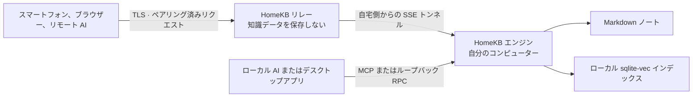

# HomeKB

自分のコンピューターに置いたまま、ローカルからも外出先からも AI が使える個人向け Markdown ナレッジベースです。

- **ファイルが中心。** ノートは、自分で管理するフォルダー内の通常の `.md` ファイルのままです。
- **Agent ネイティブ。** Claude Code、Codex、Claude、ChatGPT、そのほかの MCP クライアントがノートを検索・閲覧・作成・更新・共有できます。
- **設計そのものがローカルファースト。** インデックス、検索、書き込みは自宅のコンピューターに置き、AI 呼び出しには自分で設定したプロバイダーだけを使います。
- **アカウント不要のリモートアクセス。** 1 回限りのコードでペアリングし、リレーが保存するのは関係情報とトークンハッシュだけです。ナレッジベースの内容は保存しません。

[English](README.md) · [简体中文](README.zh-CN.md) · [日本語](README.ja.md)

> [!IMPORTANT]
>

---

## 知識は、自宅のコンピューターに

HomeKB は Markdown フォルダーをセマンティックなナレッジベースに変換します。データの所有権をクラウドアプリへ移す必要はありません。

ノートを `~/.homekb/notes/` に置くか、既存の Markdown フォルダーを指定すると、Rust エンジンがローカルの sqlite-vec インデックスを差分更新します。その後は、意味による検索、引用付きの質問応答、ノートの編集、MCP 経由での AI Agent 利用が可能になります。

製品の中核はコマンドラインエンジンです。デスクトップアプリと Web UI は同じ RPC 契約を使うレンダラーであり、リレーは外部クライアントと自宅で動くエンジンを結ぶパイプにすぎません。

---

## できること

- Markdown から要約、チャンク、文書タイプ、質問候補、埋め込みを生成。
- 文書要約とチャンクの 2 つの KNN プールを検索し、RRF で統合。
- top-K ではなくカテゴリー全体の網羅が必要な質問では、カテゴリー列挙へ切り替え。
- ローカルノートだけを根拠に、出典付きで質問へ回答。
- CLI または MCP からノートを作成、閲覧、更新、一覧表示、セマンティック検索。
- 未公開の下書きを自宅のコンピューターに保存し、ペアリング済みクライアント間で共有。
- デスクトップと Web UI で Markdown とローカル画像を表示し、貼り付け・ドラッグ＆ドロップによる画像追加とノート編集に対応。
- 単一ノートの公開リンクを作成し、パスワード、期限、即時失効を設定可能。
- 自宅側から開始するトンネルでブラウザーや AI クライアントを接続。自宅に公開 IP は不要。

---

## 仕組み



HomeKB は、独立してデプロイできる 3 つの要素で構成されます。

| 要素                    | 役割                                                                              |
| --------------------- | ------------------------------------------------------------------------------- |
| **エンジン**（`engine/`）   | コンパイル、検索、Q&A、ローカル MCP、ローカル HTTP RPC、共有、ペアリング、トンネルを担う自己完結型 Rust CLI。             |
| **クライアント**（`client/`） | 1 つの Next.js UI を 2 つの形で提供。純粋な Web フロントエンドと、ローカルエンジンを導入・接続する Tauri デスクトップレンダラー。 |
| **リレー**（`relay/`）     | Cloudflare Workers 版と Node 版を同じ契約で提供。RPC、ストリーム、バイナリアセットを転送し、ナレッジベースの内容は保存しない。   |

プロトコルとデータ配置の正本は [docs/ARCHITECTURE.md](docs/ARCHITECTURE.md) です。

---

## クイックスタート：エンジン

現在公開している導入方法は、ソースからのビルドです。新しい Rust ツールチェーンと AI プロバイダーの API キーが必要です。

```bash
git clone https://github.com/do-md/homekb.git
cd homekb/engine
cargo install --path cli

# OpenAI の簡易設定：埋め込みと要約生成をまとめて設定します。
homekb init --openai-key "$OPENAI_API_KEY"

# 既存の Markdown フォルダーをそのまま索引化することもできます。
# homekb init --notes "$HOME/Documents/notes" --openai-key "$OPENAI_API_KEY"

homekb reindex
homekb query "ローカルファーストな保存について、以前どんな判断をした？"
homekb ask "ローカルファーストな保存に関するノートを要約して。"
```

`homekb init` はデータディレクトリと `~/.homekb/config.toml` を作成します。HomeKB には OpenAI、Gemini、Voyage、Cohere、DeepSeek、Qwen のプリセットがあり、OpenAI 互換のカスタムエンドポイントにも対応します。詳しくは [AI プロバイダー設定](docs/ARCHITECTURE.md#ai-provider-presets)を参照してください。

macOS でコンパイルをバックグラウンド実行するには：

```bash
homekb watch --install --interval 300
```

Linux と Windows では、現時点ではプロセスマネージャーから `homekb watch` を実行してください。組み込みのサービス登録は macOS のみ対応しています。

---

## ローカルで AI を接続

HomeKB はすべての MCP クライアントに同じツールを公開します。

`kb_search` · `kb_read` · `kb_create` · `kb_update` · `kb_list` · `kb_status` · `kb_share`

Claude Code：

```bash
claude mcp add homekb -- homekb mcp
```

Codex：

```bash
codex mcp add homekb -- homekb mcp
```

MCP サーバーは stdio で動作し、ローカルエンジンを直接呼び出します。リレーは使いません。

---

## リモートアクセス

リモートアクセスでは、HomeKB の接続サービスであるリレーと、自宅のコンピューターから開始する外向きトンネルを使います。セルフホストには Cloudflare Workers 版を推奨し、自分のサーバー向けに単体の Node + SQLite 版も用意しています。

1. [Cloudflare Workers ガイド](relay/cf/README.md)に従ってリレーをデプロイするか、Node 版を起動します。
2. 自宅のコンピューターを登録し、トンネルを開始します。

   ```bash
   homekb register --relay https://your-relay.example.com
   homekb tunnel --install --interval 0  # macOS：コンパイルは watch が担当
   homekb pair
   ```
3. Web UI に 8 文字のペアリングコードを入力します。または `https://your-relay.example.com/api/mcp` を Claude や ChatGPT のカスタム MCP コネクターとして追加し、OAuth 認可画面でコードを入力します。

`homekb watch` を登録していない場合は `--interval 0` を省略してください。トンネルの既定値である 300 秒間隔でコンパイルも実行できます。

ブラウザーと AI クライアントは同じペアリング方式を使います。HomeKB アカウントは不要です。コードは 1 回限りで、10 分後に失効します。

---

## データと信頼モデル

| データ        | 保存場所                                                      |
| ---------- | --------------------------------------------------------- |
| ノート        | `~/.homekb/notes/`、または設定した任意の Markdown ディレクトリ。            |
| 下書きとアセット   | `~/.homekb/drafts/` と `~/.homekb/assets/`。                |
| 検索スナップショット | `~/.homekb/index/index.db`。クラウドドライブ同期に適した単一ファイル。          |
| 作業データベース   | OS のアプリケーションデータ領域。クラウド同期による WAL 破損を避けるため、データルートの外に配置。     |
| 設定と AI キー  | `~/.homekb/config.toml`。データルート全体を同期する場合は、このファイルを除外してください。 |
| リレーの状態     | ペアリング関係、共有ルーティング、SHA-256 トークンハッシュ。ノートやインデックスは含まれません。      |

次の 2 つの境界は明確にしておく必要があります。

- **保存時：**リレーはノート、添付ファイル、検索結果、インデックスを保存しません。自宅のコンピューターが常に唯一の正本です。
- **転送時：**リモートリクエストは TLS 終端後にリレーのメモリを通過します。埋め込み、要約、回答に使うテキストは、設定した AI プロバイダーへ到達します。現在のプロトコルはエンドツーエンド暗号化ではありません。リレーをセルフホストすれば HomeKB 運営者を信頼経路から外せますが、自分で選んだ AI プロバイダーまで外すことはできません。

完全な説明は[リレーの信頼境界](docs/ARCHITECTURE.md#relay-trust-boundary)を参照してください。

---

## エンジンコマンド

HomeKB は Git のようなサブコマンド方式です。REPL もクライアント依存もありません。

```text
homekb init       データツリーと設定を作成
homekb reindex    変更されたノートを差分コンパイル
homekb watch      定期的な差分コンパイルを実行
homekb query      セマンティック検索
homekb ask        ライブラリを根拠に引用付きで回答
homekb new        Markdown ノートを作成
homekb status     インデックスの状態を確認
homekb rebuild    新しい埋め込み空間向けに再構築
homekb mcp        stdio でローカル MCP を提供
homekb serve      ローカル HTTP RPC とアセットを提供
homekb register   接続サービスへ登録
homekb pair       1 回限りのペアリングコードを生成
homekb share      公開ノートリンクを作成・一覧・失効
homekb tunnel     自宅とリレーの接続を維持
```

完全なオプションは `homekb <command> --help` で確認できます。

---

## 開発

エンジン：

```bash
cd engine
cargo test
cargo build
```

Web UI と Node リレー：

```bash
cd client
npm install --include=dev
npm run dev          # Web UI: http://localhost:3000
npm run relay:dev    # Node relay: http://localhost:8787
npm test
```

Cloudflare Workers リレー：

```bash
cd relay/cf
npm install --include=dev
npx wrangler dev
```

デスクトップ版は Tauri 2 を使い、Web UI と同じクライアントコードを共有します。Web 開発サーバーを起動してから、`client/` で `npm run tauri dev` を実行してください。

コントリビューション規約と「プロトコル優先」の手順は [AGENTS.md](AGENTS.md) と [docs/ARCHITECTURE.md](docs/ARCHITECTURE.md) にあります。

---

## 現在の状態

- Rust エンジン、ローカル MCP、Node リレー、Workers リレー、Web UI、macOS デスクトップシェルは実装済みで、組み合わせてテストしています。
- リモート MCP のペアリングは claude.ai、Claude モバイルアプリ、ChatGPT Web で動作確認済みです。
- macOS、Linux、Windows 向けエンジンのリリース自動化はありますが、最初の公開 `engine-v*` リリースはまだタグ付けされていません。
- バックグラウンドサービスの登録は macOS のみ対応しています。Linux と Windows では外部のプロセスマネージャーで `watch` と `tunnel` を管理します。
- エンドツーエンド暗号化、ネイティブモバイルアプリ、競合解決、ChatGPT Deep Research 用の `search` / `fetch` ツールは未実装です。

現時点の HomeKB は、本番運用可能な製品としては案内していません。配布と初回セットアップ体験を仕上げるまで、設計と実装を公開し、検証できる状態で開発を進めます。

---

## ライセンス

HomeKB リポジトリが所有するソースコードは [MIT License](LICENSE) で提供されます。ライセンス条件に従い、使用、変更、配布、再許諾、販売が可能です。

MIT License は第三者依存関係を再ライセンスするものではありません。特に `@do-md/core-react@0.2.14` は PolyForm Noncommercial License 1.0.0 のままで、非商用利用の制限が残ります。HomeKB の完全なビルドを配布する前に、[第三者ライセンスに関する通知](THIRD_PARTY_NOTICES.md)を確認してください。

---

## ドキュメントとフィードバック

- [アーキテクチャとプロトコル契約](docs/ARCHITECTURE.md)
- [プロダクトデザイン概要](docs/DESIGN-BRIEF.md)
- [Cloudflare リレーのデプロイ](relay/cf/README.md)
- [GitHub Issues](https://github.com/do-md/homekb/issues)