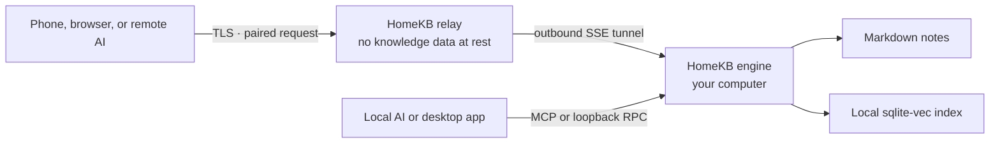

# HomeKB

A personal Markdown knowledge base that lives on your computer and stays within reach of your AI — locally or from anywhere.

- **Files first.** Your notes remain ordinary `.md` files in a folder you control.
- **Agent native.** Claude Code, Codex, Claude, ChatGPT, and other MCP clients can search, read, create, update, and share notes.
- **Local by construction.** The index, retrieval, and writes stay on your home computer; AI calls use the provider you configure.
- **Remote without an account.** Pair with a one-time code; the relay stores relationships and token hashes, never your knowledge-base content at rest.
- **Two commands to your phone.** Install the engine, run `homekb pair`, and finish setup in the Web UI.

[English](README.md) · [简体中文](README.zh-CN.md) · [日本語](README.ja.md)

---

## Your knowledge lives at home

HomeKB turns a folder of Markdown files into a semantic knowledge base without moving ownership into a cloud app.

Drop notes into `~/.homekb/notes/` — or point HomeKB at an existing Markdown folder — and the Rust engine incrementally builds a local sqlite-vec index. You can then search by meaning, ask questions with citations, edit notes, or let an AI agent work with the library through MCP.

The command-line engine is the product core. The desktop app and Web UI are renderers over the same RPC contract, while the relay is only a pipe between a remote client and the engine running at home.

---

## What it can do

- Compile Markdown into summaries, chunks, document types, suggested questions, and embeddings.
- Retrieve with dual-pool KNN over document summaries and chunks, fused with RRF.
- Switch to whole-category enumeration when a question asks for coverage rather than a top-K match.
- Answer questions from local notes with source citations.
- Create, read, update, list, and semantically search notes through the CLI or MCP.
- Keep unpublished drafts on the home device and share them across paired clients.
- Render Markdown and local images, upload pasted or dropped images, and edit notes from the desktop or Web UI.
- Create revocable public links for individual notes, with optional passwords and expiry.
- Manage scheduled compilation and start a full index rebuild remotely from the Web UI.
- Connect remote browsers and AI clients through an outbound tunnel — no public IP on the home computer required.

---

## How it works



HomeKB has three independently useful pieces:

| Piece                  | Role                                                                                                                                     |
| ---------------------- | ---------------------------------------------------------------------------------------------------------------------------------------- |
| **Engine** (`engine/`) | A self-contained Rust CLI for compilation, retrieval, Q&A, local MCP, local HTTP RPC, sharing, pairing, and tunneling.                   |
| **Client** (`client/`) | One Next.js UI for two surfaces: a pure Web frontend and a Tauri desktop renderer that installs and talks to the local engine.           |
| **Relay** (`relay/`)   | Interchangeable Cloudflare Workers and Node targets that forward RPC, streams, and binary assets without storing knowledge-base content. |

The protocol and data-layout contract lives in [docs/ARCHITECTURE.md](docs/ARCHITECTURE.md).

---

## Quick start

The engine is a **single self-contained binary** — bundled SQLite, rustls TLS, no runtime dependencies and no Rust toolchain required. Install it through your platform's package manager:

### 1. Install the engine

```bash
# macOS / Linux — Homebrew
brew install do-md/tap/homekb

# macOS / Linux — install script
curl -fsSL https://raw.githubusercontent.com/do-md/homekb/main/install.sh | sh

# Windows — Scoop
scoop bucket add homekb https://github.com/do-md/scoop-bucket
scoop install homekb
```

Or download a binary directly from the [latest release](https://github.com/do-md/homekb/releases). Prefer building from source? `cd engine && cargo install --path cli` (needs a recent Rust toolchain).

The install script drops the binary in `~/.local/bin` and adds that directory to your shell's `PATH` automatically (zsh, bash, and fish). Open a new terminal — or `source` your shell rc file — so `homekb` resolves.

### 2. Pair this computer

```bash
homekb pair
```

On first run, this registers the computer with HomeKB's built-in official connection service, starts the background connection and scheduled-compilation services on macOS, and prints a single-use code valid for ten minutes. No HomeKB account is created.

Automatic background-service installation is currently macOS-only. See [Current status](#current-status) for Linux and Windows.

### 3. Open the Web UI

Open [www.homekb.app](https://www.homekb.app) on your phone or another browser and enter the code. The service address is already selected for the default path.

### 4. Finish in the browser

- Open **Settings** and configure **Embedding** and **Summary**. **Ask** is optional because connected MCP agents bring their own model.
- Choose a built-in preset for OpenAI, Gemini, Voyage, Cohere, DeepSeek, or Qwen, or use a custom OpenAI-compatible endpoint.
- Open **Status** to watch the first compilation. On macOS, scheduled compilation is on by default after first pairing; you can pause it or change the interval there.

Your Markdown files now stay on the home computer while the paired browser can search, read, edit, and manage the library remotely.

---

## Desktop app for macOS

Prefer a native window on the Mac that hosts your knowledge base? [Download the latest HomeKB desktop app](https://github.com/do-md/homekb/releases/latest/download/HomeKB_aarch64.dmg). The current desktop release supports Apple Silicon Macs; the engine and Web UI remain the primary cross-platform path.

The desktop app is a native shell over the same local engine and interface:

- If HomeKB Engine is already installed through Homebrew, the install script, or another supported location, the app finds and reuses it — no duplicate engine is installed.
- If no engine is found, the app downloads the latest compatible engine, installs it locally, and starts it for you.
- App updates arrive through the built-in updater, while engine updates can be checked and installed separately from **Settings**.

Your notes, index, and AI credentials stay in the same local HomeKB directories whether you use the desktop app, CLI, or Web UI.

---

## Use it from the CLI

The browser-first path needs no manual initialization. Use `homekb init` when you want to configure providers in the terminal or point HomeKB at an existing Markdown directory:

```bash
homekb init --notes "$HOME/Documents/notes" --openai-key "$OPENAI_API_KEY"
homekb reindex
homekb query "What did I decide about local-first storage?"
homekb ask "Summarize my notes about local-first storage."
```

Without `--notes`, HomeKB uses `~/.homekb/notes/`. `homekb init` creates the data directories and `~/.homekb/config.toml`. The same provider presets available in the Web UI can be configured in the file; see [AI provider configuration](docs/ARCHITECTURE.md#ai-provider-presets).

To keep compilation running in the background on macOS:

```bash
homekb watch --install --interval 300
```

You can also enable, pause, and change this schedule from the app's **Status** page. On Linux and Windows, run `homekb watch` through your process manager for now.

---

## Connect an AI

HomeKB exposes the same tools to every MCP client:

`kb_search` · `kb_read` · `kb_create` · `kb_update` · `kb_list` · `kb_status` · `kb_share`

Claude Code:

```bash
claude mcp add homekb -- homekb mcp
```

Codex:

```bash
codex mcp add homekb -- homekb mcp
```

This local MCP server runs over stdio and calls the engine directly. No connection service is involved.

For Claude or ChatGPT on another device, add the official remote MCP endpoint as a custom connector:

```text
https://homekb-relay.wangjintaoapp.workers.dev/api/mcp
```

Run `homekb pair` to generate a code, then enter it on the connector's OAuth authorization page. The same single-use code pairs browsers and AI clients, and expires after ten minutes. Prefer to operate the connection service yourself? See [Self-hosting the connection service](#self-hosting-the-connection-service).

---

## Data and trust model

| Data                      | Where it lives                                                                                          |
| ------------------------- | ------------------------------------------------------------------------------------------------------- |
| Notes                     | `~/.homekb/notes/`, or any Markdown directory you configure.                                            |
| Drafts and assets         | `~/.homekb/drafts/` and `~/.homekb/assets/`.                                                            |
| Search snapshot           | `~/.homekb/index/index.db`, a single-file snapshot suitable for cloud-drive sync.                       |
| Working database          | The platform application-data directory, kept outside the data root to avoid cloud-sync/WAL corruption. |
| Configuration and AI keys | `~/.homekb/config.toml`. Exclude this file if you sync the whole data root.                             |
| Relay state               | Pairing relationships, share routing, and SHA-256 token hashes — no notes or index.                     |

There are two boundaries worth stating plainly:

- **At rest:** the relay stores no note, attachment, search result, or index content. Your home computer remains the source of truth.
- **In transit:** remote requests pass through relay memory after TLS termination. Text used for embeddings, summaries, or answers reaches the AI provider you configure. The current protocol is not end-to-end encrypted. Self-hosting the relay removes the HomeKB operator from this trust path; it does not remove the AI provider you choose.

The default setup uses HomeKB's official hosted relay, which stores zero knowledge-base data at rest. [Self-hosting the connection service](#self-hosting-the-connection-service) removes that operator from the path entirely.

See [Relay trust boundary](docs/ARCHITECTURE.md#relay-trust-boundary) for the full model.

---

## Engine commands

HomeKB follows a Git-style subcommand model — no REPL and no client dependency.

```text
homekb init       Create the data tree and configuration
homekb reindex    Incrementally compile changed notes
homekb watch      Run scheduled incremental compilation
homekb query      Search semantically
homekb ask        Answer from the library with citations
homekb new        Create a Markdown note
homekb status     Inspect index health
homekb rebuild    Rebuild for a new embedding vector space
homekb mcp        Serve local MCP over stdio
homekb serve      Serve local HTTP RPC and assets
homekb register   Register with a connection service
homekb pair       Bootstrap the default connection on first run, then generate a one-time code
homekb share      Create, list, or revoke public note links
homekb tunnel     Keep the home connected to the relay
homekb start      Start the background services on this machine
homekb stop       Pause the background services (reversible; keeps everything)
homekb uninstall  Remove the engine from this machine — never touches your notes
```

Run `homekb <command> --help` for complete options.

On macOS, `homekb watch --install` manages the same scheduled-compilation service exposed on the app's **Status** page; either interface can enable it or change its interval.

### Pause or remove the engine

Three graduated commands manage the engine's footprint on a machine — for example a spare computer or one you're handing on. **None of them ever deletes your knowledge base:** `~/.homekb/` (notes, assets, index, drafts, and `config.toml`) is always left intact.

```bash
homekb stop          # Pause: stop the background tunnel + compile services. Everything stays installed;
                     # resume any time with `homekb start`. Remote devices just see the home go offline.

homekb uninstall     # Preview the full removal — prints exactly what it would do and changes nothing.
homekb uninstall --yes   # Remove the engine: unregister from the connection service (AI keys kept),
                         # stop the services, delete the regenerable working DB + logs, delete the binary.
```

`homekb uninstall` never removes anything under `~/.homekb/`, so reinstalling the engine and running `homekb reindex` restores your library exactly where you left off. Homebrew and Scoop installs are left for the package manager (`brew uninstall homekb` / `scoop uninstall homekb`). These service commands are macOS-only for now; on Linux and Windows, stop the foreground `homekb tunnel` / `homekb watch` process through your process manager instead.

---

## Development

Engine:

```bash
cd engine
cargo test
cargo build
```

Web UI and Node relay:

```bash
cd client
npm install --include=dev
npm run dev          # Web UI: http://localhost:3000
npm run relay:dev    # Node relay: http://localhost:8787
npm test
```

Cloudflare Workers relay:

```bash
cd relay/cf
npm install --include=dev
npx wrangler dev
```

Desktop development uses Tauri 2 and the same client code. Start the Web dev server, then run `npm run tauri dev` from `client/`.

For contribution rules and the protocol-first workflow, read [AGENTS.md](AGENTS.md) and [docs/ARCHITECTURE.md](docs/ARCHITECTURE.md).

---

## Current status

- The Rust engine, local MCP, Node relay, Workers relay, Web UI, and macOS desktop shell are implemented and tested together.
- Remote MCP pairing has been verified with claude.ai, the Claude mobile app, and ChatGPT Web.
- The engine ships as prebuilt binaries for macOS (Apple Silicon + Intel), Linux (x86_64, glibc ≥ 2.35), and Windows (x86_64), published on every `engine-v*` tag and installable via Homebrew, Scoop, or the install script.
- Background-service installation is macOS-only; Linux and Windows currently run `watch` and `tunnel` under an external process manager.
- End-to-end encryption, native mobile apps, conflict resolution, and ChatGPT Deep Research `search`/`fetch` tools are not implemented.

HomeKB is not presented as production-ready yet. The design is intentionally open and inspectable while the distribution and first-run experience are being finished.

---

## Self-hosting the connection service

The default path uses HomeKB's hosted Cloudflare Workers relay. Running your own is an optional sovereignty upgrade: it removes the HomeKB-operated service from the remote request path while preserving the same pairing and client workflow.

- Deploy the Workers target with the [Cloudflare Workers guide](relay/cf/README.md).
- Or run the standalone Node target: one process, one SQLite file, and the same protocol.

Register the home computer with your service, keep its outbound connection running, and generate a new code:

```bash
homekb register --relay https://your-relay.example.com
homekb tunnel --install --interval 0  # macOS; scheduled compilation is managed separately
homekb watch --install --interval 300 # macOS
homekb pair
```

If you already completed Quick start, the background services are installed; `homekb register --relay ...` switches services and restarts the installed connection automatically, so you only need to run `homekb pair` afterward. On Linux and Windows, run `homekb tunnel` and `homekb watch` under your process manager.

Use `https://your-relay.example.com/api/mcp` for remote Claude or ChatGPT connectors. The Web UI accepts the same service address and pairing code.

---

## License

Source code owned by the HomeKB repository is available under the [MIT License](LICENSE): you may use, modify, distribute, sublicense, and sell it under the license terms.

The MIT License does not relicense third-party dependencies. In particular, `@do-md/core-react@0.2.14` is licensed under the PolyForm Noncommercial License 1.0.0 and retains its noncommercial-use restrictions. See [Third-Party Notices](THIRD_PARTY_NOTICES.md) before distributing a complete HomeKB build.

---

## Documentation and feedback

- [Architecture and protocol contract](docs/ARCHITECTURE.md)
- [Product design brief](docs/DESIGN-BRIEF.md)
- [Cloudflare relay deployment](relay/cf/README.md)
- [GitHub Issues](https://github.com/do-md/homekb/issues)
