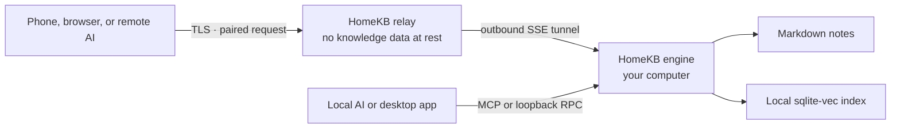

# HomeKB

A personal Markdown knowledge base that lives on your computer and stays within reach of your AI — locally or from anywhere.

- **Files first.** Your notes remain ordinary `.md` files in a folder you control.
- **Agent native.** Claude Code, Codex, Claude, ChatGPT, and other MCP clients can search, read, create, update, and share notes.
- **Local by construction.** The index, retrieval, and writes stay on your home computer; AI calls use the provider you configure.
- **Remote without an account.** Pair with a one-time code; the relay stores relationships and token hashes, never your knowledge-base content at rest.

[English](README.md) · [简体中文](README.zh-CN.md) · [日本語](README.ja.md)

> [!IMPORTANT]
>

---

## Your knowledge lives at home

HomeKB turns a folder of Markdown files into a semantic knowledge base without moving ownership into a cloud app.

Drop notes into `~/.homekb/notes/` — or point HomeKB at an existing Markdown folder — and the Rust engine incrementally builds a local sqlite-vec index. You can then search by meaning, ask questions with citations, edit notes, or let an AI agent work with the library through MCP.

The command-line engine is the product core. The desktop app and Web UI are renderers over the same RPC contract, while the relay is only a pipe between a remote client and the engine running at home.

---

## What it can do

- Compile Markdown into summaries, chunks, document types, suggested questions, and embeddings.
- Retrieve with dual-pool KNN over document summaries and chunks, fused with RRF.
- Switch to whole-category enumeration when a question asks for coverage rather than a top-K match.
- Answer questions from local notes with source citations.
- Create, read, update, list, and semantically search notes through the CLI or MCP.
- Keep unpublished drafts on the home device and share them across paired clients.
- Render Markdown and local images, upload pasted or dropped images, and edit notes from the desktop or Web UI.
- Create revocable public links for individual notes, with optional passwords and expiry.
- Connect remote browsers and AI clients through an outbound tunnel — no public IP on the home computer required.

---

## How it works



HomeKB has three independently useful pieces:

| Piece                  | Role                                                                                                                                     |
| ---------------------- | ---------------------------------------------------------------------------------------------------------------------------------------- |
| **Engine** (`engine/`) | A self-contained Rust CLI for compilation, retrieval, Q&A, local MCP, local HTTP RPC, sharing, pairing, and tunneling.                   |
| **Client** (`client/`) | One Next.js UI for two surfaces: a pure Web frontend and a Tauri desktop renderer that installs and talks to the local engine.           |
| **Relay** (`relay/`)   | Interchangeable Cloudflare Workers and Node targets that forward RPC, streams, and binary assets without storing knowledge-base content. |

The protocol and data-layout contract lives in [docs/ARCHITECTURE.md](docs/ARCHITECTURE.md).

---

## Quick start: engine

The engine is a **single self-contained binary** — bundled SQLite, rustls TLS, no runtime dependencies and no Rust toolchain required. Install it through your platform's package manager:

```bash
# macOS / Linux — Homebrew
brew install do-md/tap/homekb

# macOS / Linux — install script
curl -fsSL https://raw.githubusercontent.com/do-md/homekb/main/install.sh | sh

# Windows — Scoop
scoop bucket add homekb https://github.com/do-md/scoop-bucket
scoop install homekb
```

Or download a binary directly from the [latest release](https://github.com/do-md/homekb/releases). Prefer building from source? `cd engine && cargo install --path cli` (needs a recent Rust toolchain).

Then point it at an AI provider and index your notes:

```bash
# OpenAI shortcut: configures embedding + summary generation.
homekb init --openai-key "$OPENAI_API_KEY"

# Or index an existing Markdown folder.
# homekb init --notes "$HOME/Documents/notes" --openai-key "$OPENAI_API_KEY"

homekb reindex
homekb query "What did I decide about local-first storage?"
homekb ask "Summarize my notes about local-first storage."
```

`homekb init` creates the data directories and `~/.homekb/config.toml`. HomeKB also supports built-in presets for OpenAI, Gemini, Voyage, Cohere, DeepSeek, and Qwen, plus custom OpenAI-compatible endpoints. See [AI provider configuration](docs/ARCHITECTURE.md#ai-provider-presets).

To keep compilation running in the background on macOS:

```bash
homekb watch --install --interval 300
```

On Linux and Windows, use `homekb watch` in your process manager for now; built-in service installation is currently macOS-only.

---

## Connect an AI locally

HomeKB exposes the same tools to every MCP client:

`kb_search` · `kb_read` · `kb_create` · `kb_update` · `kb_list` · `kb_status` · `kb_share`

Claude Code:

```bash
claude mcp add homekb -- homekb mcp
```

Codex:

```bash
codex mcp add homekb -- homekb mcp
```

The MCP server runs over stdio and calls the local engine directly. No relay is involved.

---

## Remote access

Remote access uses a connection service — HomeKB's relay — and an outbound tunnel from the home computer. The recommended self-host target is Cloudflare Workers; a standalone Node + SQLite target is included for running on your own server.

1. Deploy a relay by following [the Cloudflare Workers guide](relay/cf/README.md), or run the Node target.
2. Register the home computer and start its tunnel:

   ```bash
   homekb register --relay https://your-relay.example.com
   homekb tunnel --install --interval 0  # macOS; watch handles compilation
   homekb pair
   ```
3. Use the eight-character pairing code in the Web UI, or add `https://your-relay.example.com/api/mcp` as a custom MCP connector in Claude or ChatGPT and enter the code during OAuth authorization.

If you did not install `homekb watch`, omit `--interval 0`; the tunnel's default 300-second interval can handle compilation as well.

The same pairing flow works for browsers and AI clients. There is no HomeKB account, and a pairing code is single-use and expires after ten minutes.

---

## Data and trust model

| Data                      | Where it lives                                                                                          |
| ------------------------- | ------------------------------------------------------------------------------------------------------- |
| Notes                     | `~/.homekb/notes/`, or any Markdown directory you configure.                                            |
| Drafts and assets         | `~/.homekb/drafts/` and `~/.homekb/assets/`.                                                            |
| Search snapshot           | `~/.homekb/index/index.db`, a single-file snapshot suitable for cloud-drive sync.                       |
| Working database          | The platform application-data directory, kept outside the data root to avoid cloud-sync/WAL corruption. |
| Configuration and AI keys | `~/.homekb/config.toml`. Exclude this file if you sync the whole data root.                             |
| Relay state               | Pairing relationships, share routing, and SHA-256 token hashes — no notes or index.                     |

There are two boundaries worth stating plainly:

- **At rest:** the relay stores no note, attachment, search result, or index content. Your home computer remains the source of truth.
- **In transit:** remote requests pass through relay memory after TLS termination. Text used for embeddings, summaries, or answers reaches the AI provider you configure. The current protocol is not end-to-end encrypted. Self-hosting the relay removes the HomeKB operator from this trust path; it does not remove the AI provider you choose.

See [Relay trust boundary](docs/ARCHITECTURE.md#relay-trust-boundary) for the full model.

---

## Engine commands

HomeKB follows a Git-style subcommand model — no REPL and no client dependency.

```text
homekb init       Create the data tree and configuration
homekb reindex    Incrementally compile changed notes
homekb watch      Run scheduled incremental compilation
homekb query      Search semantically
homekb ask        Answer from the library with citations
homekb new        Create a Markdown note
homekb status     Inspect index health
homekb rebuild    Rebuild for a new embedding vector space
homekb mcp        Serve local MCP over stdio
homekb serve      Serve local HTTP RPC and assets
homekb register   Register with a connection service
homekb pair       Generate a one-time pairing code
homekb share      Create, list, or revoke public note links
homekb tunnel     Keep the home connected to the relay
```

Run `homekb <command> --help` for complete options.

---

## Development

Engine:

```bash
cd engine
cargo test
cargo build
```

Web UI and Node relay:

```bash
cd client
npm install --include=dev
npm run dev          # Web UI: http://localhost:3000
npm run relay:dev    # Node relay: http://localhost:8787
npm test
```

Cloudflare Workers relay:

```bash
cd relay/cf
npm install --include=dev
npx wrangler dev
```

Desktop development uses Tauri 2 and the same client code. Start the Web dev server, then run `npm run tauri dev` from `client/`.

For contribution rules and the protocol-first workflow, read [AGENTS.md](AGENTS.md) and [docs/ARCHITECTURE.md](docs/ARCHITECTURE.md).

---

## Current status

- The Rust engine, local MCP, Node relay, Workers relay, Web UI, and macOS desktop shell are implemented and tested together.
- Remote MCP pairing has been verified with claude.ai, the Claude mobile app, and ChatGPT Web.
- The engine ships as prebuilt binaries for macOS (Apple Silicon + Intel), Linux (x86_64, glibc ≥ 2.35), and Windows (x86_64), published on every `engine-v*` tag and installable via Homebrew, Scoop, or the install script.
- Background-service installation is macOS-only; Linux and Windows currently run `watch` and `tunnel` under an external process manager.
- End-to-end encryption, native mobile apps, conflict resolution, and ChatGPT Deep Research `search`/`fetch` tools are not implemented.

HomeKB is not presented as production-ready yet. The design is intentionally open and inspectable while the distribution and first-run experience are being finished.

---

## Documentation and feedback

- [Architecture and protocol contract](docs/ARCHITECTURE.md)
- [Product design brief](docs/DESIGN-BRIEF.md)
- [Cloudflare relay deployment](relay/cf/README.md)
- [GitHub Issues](https://github.com/do-md/homekb/issues)