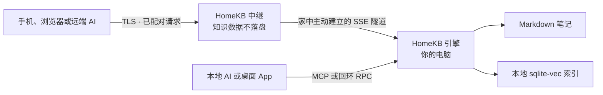

# HomeKB

一个住在你自己电脑里的 Markdown 个人知识库，让你的 AI 无论在本机还是远端，都能随时触达它。

- **文件优先。** 笔记始终是你所控制目录中的普通 `.md` 文件。
- **Agent 原生。** Claude Code、Codex、Claude、ChatGPT 及其他 MCP 客户端可以搜索、阅读、新建、更新和分享笔记。
- **从架构上坚持本地。** 索引、检索与写入保留在家中电脑；AI 调用只使用你自己配置的 provider。
- **无需账号的远程访问。** 用一次性配对码连接；中继只保存配对关系和 token 哈希，不会持久化任何知识库内容。

[English](README.md) · [简体中文](README.zh-CN.md) · [日本語](README.ja.md)

> [!IMPORTANT]
>

---

## 你的知识，住在家里

HomeKB 把一个 Markdown 文件夹变成语义知识库，同时不会把数据所有权交给某个云端应用。

把笔记放进 `~/.homekb/notes/`，或者让 HomeKB 直接使用你已有的 Markdown 目录。Rust 引擎会增量生成本地 sqlite-vec 索引。此后，你可以按语义搜索、基于引用向知识库提问、编辑笔记，或让 AI Agent 通过 MCP 直接使用整个知识库。

命令行引擎是产品核心。桌面 App 与 Web UI 都只是同一套 RPC 契约上的渲染器；中继也只是一条把远端客户端连接到家中引擎的管道。

---

## 它能做什么

- 把 Markdown 编译成摘要、文本块、文档类型、建议问题与向量。
- 在文档摘要池与文本块池上执行双路 KNN，并通过 RRF 融合排序。
- 当问题要求“列出全部”而不是 top-K 命中时，自动切换为完整类目枚举。
- 仅基于本地笔记回答问题，并提供来源引用。
- 通过 CLI 或 MCP 新建、读取、更新、列出与语义检索笔记。
- 把未发布草稿保存在家中电脑，并在已配对客户端之间共享。
- 在桌面端和 Web 端渲染 Markdown 与本地图片，支持粘贴/拖放上传图片和编辑笔记。
- 为单篇笔记创建可撤销的公开链接，可选密码与过期时间。
- 通过由家中电脑主动建立的隧道连接远端浏览器和 AI 客户端，无需家庭公网 IP。

---

## 工作方式



HomeKB 由三个可以独立部署的部分组成：

| 部分                 | 职责                                                             |
| ------------------ | -------------------------------------------------------------- |
| **引擎**（`engine/`）  | 自包含 Rust CLI，负责编译、检索、问答、本地 MCP、本地 HTTP RPC、分享、配对和隧道。           |
| **客户端**（`client/`） | 一套 Next.js UI、两种形态：纯前端 Web UI，以及负责安装并连接本地引擎的 Tauri 桌面渲染器。      |
| **中继**（`relay/`）   | 可互换的 Cloudflare Workers 与 Node 实现，转发 RPC、流式响应和二进制资源，但不存储知识库内容。 |

协议和数据目录的唯一契约见 [docs/ARCHITECTURE.md](docs/ARCHITECTURE.md)。

---

## 快速开始：引擎

目前公开可用的方式是从源码构建引擎。你需要较新的 Rust 工具链和一个 AI 服务商的 API key。

```bash
git clone https://github.com/do-md/homekb.git
cd homekb/engine
cargo install --path cli

# OpenAI 快捷配置：同时配置 embedding 与摘要生成。
homekb init --openai-key "$OPENAI_API_KEY"

# 或者直接索引已有的 Markdown 目录。
# homekb init --notes "$HOME/Documents/notes" --openai-key "$OPENAI_API_KEY"

homekb reindex
homekb query "我之前对本地优先存储做过什么决定？"
homekb ask "总结我关于本地优先存储的笔记。"
```

`homekb init` 会创建数据目录与 `~/.homekb/config.toml`。HomeKB 还内置 OpenAI、Gemini、Voyage、Cohere、DeepSeek、Qwen 的 provider preset，并支持自定义 OpenAI 兼容端点。详见 [AI provider 配置](docs/ARCHITECTURE.md#ai-provider-presets)。

在 macOS 上让编译常驻后台：

```bash
homekb watch --install --interval 300
```

Linux 与 Windows 目前请通过系统进程管理器运行 `homekb watch`；内置服务安装暂时仅支持 macOS。

---

## 在本机连接 AI

HomeKB 向所有 MCP 客户端暴露同一组工具：

`kb_search` · `kb_read` · `kb_create` · `kb_update` · `kb_list` · `kb_status` · `kb_share`

Claude Code：

```bash
claude mcp add homekb -- homekb mcp
```

Codex：

```bash
codex mcp add homekb -- homekb mcp
```

MCP server 通过 stdio 运行并直接调用本地引擎，完全不经过中继。

---

## 远程访问

远程访问使用一个连接服务——HomeKB 中继——以及由家中电脑主动建立的出站隧道。推荐的自部署目标是 Cloudflare Workers；仓库也包含可在自有服务器运行的独立 Node + SQLite 版本。

1. 按照 [Cloudflare Workers 指南](relay/cf/README.md)部署中继，或运行 Node 版本。
2. 注册家中电脑并启动隧道：

   ```bash
   homekb register --relay https://your-relay.example.com
   homekb tunnel --install --interval 0  # macOS；由 watch 负责编译
   homekb pair
   ```
3. 在 Web UI 中输入八位配对码；或者把 `https://your-relay.example.com/api/mcp` 添加为 Claude 或 ChatGPT 的自定义 MCP 连接器，并在 OAuth 授权页输入配对码。

如果你没有安装 `homekb watch`，可以省略 `--interval 0`，让隧道按默认的 300 秒间隔同时完成编译。

浏览器与 AI 客户端使用完全相同的配对流程。HomeKB 没有账号体系；配对码仅能使用一次，并在十分钟后过期。

---

## 数据与信任模型

| 数据         | 保存位置                                        |
| ---------- | ------------------------------------------- |
| 笔记         | `~/.homekb/notes/`，或你配置的任意 Markdown 目录。     |
| 草稿与资源      | `~/.homekb/drafts/` 与 `~/.homekb/assets/`。  |
| 检索快照       | `~/.homekb/index/index.db`，适合通过云盘同步的单文件快照。  |
| 编译工作库      | 平台应用数据目录；刻意放在数据根目录之外，避免云盘同步破坏 WAL。          |
| 配置与 AI key | `~/.homekb/config.toml`。如果同步整个数据根目录，请排除此文件。 |
| 中继状态       | 配对关系、分享路由与 SHA-256 token 哈希，不包含笔记或索引。       |

有两条边界需要说清楚：

- **静态存储：**中继不会保存笔记、附件、搜索结果或索引。家中电脑始终是唯一真源。
- **传输过程：**远程请求会在 TLS 终止后经过中继内存；用于生成向量、摘要或答案的文本会到达你配置的 AI provider。当前协议不是端到端加密。自部署中继可以把 HomeKB 运营方移出信任链，但无法移除你主动选择的 AI provider。

完整说明见 [中继信任边界](docs/ARCHITECTURE.md#relay-trust-boundary)。

---

## 引擎命令

HomeKB 采用类似 Git 的子命令模型：没有 REPL，也不依赖任何客户端。

```text
homekb init       创建数据目录与配置
homekb reindex    增量编译发生变化的笔记
homekb watch      按计划持续增量编译
homekb query      语义检索
homekb ask        基于知识库回答并提供引用
homekb new        新建 Markdown 笔记
homekb status     查看索引健康状态
homekb rebuild    为新的向量空间重新构建索引
homekb mcp        通过 stdio 提供本地 MCP
homekb serve      提供本地 HTTP RPC 与资源服务
homekb register   注册连接服务
homekb pair       生成一次性配对码
homekb share      新建、列出或撤销公开笔记链接
homekb tunnel     让家中电脑保持连接中继
```

运行 `homekb <command> --help` 查看完整参数。

---

## 开发

引擎：

```bash
cd engine
cargo test
cargo build
```

Web UI 与 Node 中继：

```bash
cd client
npm install --include=dev
npm run dev          # Web UI: http://localhost:3000
npm run relay:dev    # Node relay: http://localhost:8787
npm test
```

Cloudflare Workers 中继：

```bash
cd relay/cf
npm install --include=dev
npx wrangler dev
```

桌面端使用 Tauri 2，并与 Web UI 共用同一套客户端代码。先启动 Web 开发服务，再从 `client/` 运行 `npm run tauri dev`。

贡献规范与“协议先行”工作流见 [AGENTS.md](AGENTS.md) 和 [docs/ARCHITECTURE.md](docs/ARCHITECTURE.md)。

---

## 当前状态

- Rust 引擎、本地 MCP、Node 中继、Workers 中继、Web UI 与 macOS 桌面壳已经实现，并完成了组合测试。
- 远程 MCP 配对已在 claude.ai、Claude 手机 App 与 ChatGPT Web 上验证通过。
- 引擎已经具备 macOS、Linux、Windows 的发布自动化，但第一个公开 `engine-v*` 版本尚未打 tag。
- 后台服务安装仅支持 macOS；Linux 与 Windows 目前需要由外部进程管理器托管 `watch` 和 `tunnel`。
- 端到端加密、原生移动 App、冲突裁决，以及 ChatGPT Deep Research 所需的 `search`/`fetch` 工具尚未实现。

HomeKB 目前还不以“生产可用”产品自居。在分发与首次使用体验完成之前，其设计与实现会保持公开、可检查。

---

## 开源许可

HomeKB 仓库拥有的源代码采用 [MIT License](LICENSE)：在遵守许可条款的前提下，任何人都可以使用、修改、分发、再许可或销售这些代码。

MIT License 不会自动重许可第三方依赖。尤其是 `@do-md/core-react@0.2.14` 仍采用 PolyForm Noncommercial License 1.0.0，并保留非商业用途限制。分发完整 HomeKB 构建产物前，请阅读[第三方许可说明](THIRD_PARTY_NOTICES.md)。

---

## 文档与反馈

- [架构与协议契约](docs/ARCHITECTURE.md)
- [产品设计说明](docs/DESIGN-BRIEF.md)
- [Cloudflare 中继部署](relay/cf/README.md)
- [GitHub Issues](https://github.com/do-md/homekb/issues)
