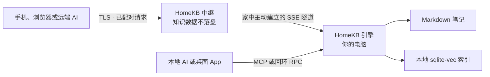

# HomeKB

一个住在你自己电脑里的 Markdown 个人知识库，让你的 AI 无论在本机还是远端，都能随时触达它。

- **文件优先。** 笔记始终是你所控制目录中的普通 `.md` 文件。
- **Agent 原生。** Claude Code、Codex、Claude、ChatGPT 及其他 MCP 客户端可以搜索、阅读、新建、更新和分享笔记。
- **从架构上坚持本地。** 索引、检索与写入保留在家中电脑；AI 调用只使用你自己配置的 provider。
- **无需账号的远程访问。** 用一次性配对码连接；中继只保存配对关系和 token 哈希，不会持久化任何知识库内容。
- **两条命令，连到手机。** 安装引擎，运行 `homekb pair`，然后在 Web UI 中完成设置。

[English](README.md) · [简体中文](README.zh-CN.md) · [日本語](README.ja.md)

---

## 你的知识，住在家里

HomeKB 把一个 Markdown 文件夹变成语义知识库，同时不会把数据所有权交给某个云端应用。

把笔记放进 `~/.homekb/notes/`，或者让 HomeKB 直接使用你已有的 Markdown 目录。Rust 引擎会增量生成本地 sqlite-vec 索引。此后，你可以按语义搜索、基于引用向知识库提问、编辑笔记，或让 AI Agent 通过 MCP 直接使用整个知识库。

命令行引擎是产品核心。桌面 App 与 Web UI 都只是同一套 RPC 契约上的渲染器；中继也只是一条把远端客户端连接到家中引擎的管道。

---

## 它能做什么

- 把 Markdown 编译成摘要、文本块、文档类型、建议问题与向量。
- 在文档摘要池与文本块池上执行双路 KNN，并通过 RRF 融合排序。
- 当问题要求“列出全部”而不是 top-K 命中时，自动切换为完整类目枚举。
- 仅基于本地笔记回答问题，并提供来源引用。
- 通过 CLI 或 MCP 新建、读取、更新、列出与语义检索笔记。
- 把未发布草稿保存在家中电脑，并在已配对客户端之间共享。
- 在桌面端和 Web 端渲染 Markdown 与本地图片，支持粘贴/拖放上传图片和编辑笔记。
- 为单篇笔记创建可撤销的公开链接，可选密码与过期时间。
- 从 Web UI 远程管理定时编译，并触发完整索引重建。
- 通过由家中电脑主动建立的隧道连接远端浏览器和 AI 客户端，无需家庭公网 IP。

---

## 工作方式



HomeKB 由三个可以独立部署的部分组成：

| 部分                 | 职责                                                             |
| ------------------ | -------------------------------------------------------------- |
| **引擎**（`engine/`）  | 自包含 Rust CLI，负责编译、检索、问答、本地 MCP、本地 HTTP RPC、分享、配对和隧道。           |
| **客户端**（`client/`） | 一套 Next.js UI、两种形态：纯前端 Web UI，以及负责安装并连接本地引擎的 Tauri 桌面渲染器。      |
| **中继**（`relay/`）   | 可互换的 Cloudflare Workers 与 Node 实现，转发 RPC、流式响应和二进制资源，但不存储知识库内容。 |

协议和数据目录的唯一契约见 [docs/ARCHITECTURE.md](docs/ARCHITECTURE.md)。

---

## 快速开始

引擎是一个**自包含的单文件程序**：内置 SQLite，使用 rustls TLS，没有运行时依赖，也不需要安装 Rust 工具链。

### 1. 安装引擎

```bash
# macOS / Linux — Homebrew
brew install do-md/tap/homekb

# macOS / Linux — 安装脚本
curl -fsSL https://raw.githubusercontent.com/do-md/homekb/main/install.sh | sh

# Windows — Scoop
scoop bucket add homekb https://github.com/do-md/scoop-bucket
scoop install homekb
```

也可以从[最新 Release](https://github.com/do-md/homekb/releases)直接下载二进制文件。希望从源码构建时，在仓库中运行 `cd engine && cargo install --path cli`；这需要较新的 Rust 工具链。

### 2. 配对这台电脑

```bash
homekb pair
```

首次运行时，它会把这台电脑注册到 HomeKB 内置的官方连接服务；在 macOS 上启动后台连接与定时编译服务；最后打印一个十分钟内有效、只能使用一次的配对码。整个过程不会创建 HomeKB 账号。

后台服务自动安装目前仅支持 macOS。Linux 与 Windows 的说明见[当前状态](#当前状态)。

### 3. 打开 Web UI

在手机或其他浏览器中打开 [www.homekb.app](https://www.homekb.app)，输入配对码。默认路径已经选好连接服务，不需要填写地址。

### 4. 在浏览器中完成设置

- 打开 **Settings**，配置必需的 **Embedding** 与 **Summary**；**Ask** 可选，因为通过 MCP 连接的 Agent 会使用自己的模型。
- 可选择 OpenAI、Gemini、Voyage、Cohere、DeepSeek、Qwen 预设，或填写自定义 OpenAI 兼容端点。
- 打开 **Status** 查看首次编译进度。在 macOS 上，首次配对后定时编译默认开启；可在这里暂停或调整间隔。

Markdown 文件始终保存在家中电脑，而已配对的浏览器现在可以远程搜索、阅读、编辑和管理知识库。

---

## macOS 客户端

如果希望在承载知识库的 Mac 上使用原生窗口，可以[下载最新版 HomeKB 客户端](https://github.com/do-md/homekb/releases/latest/download/HomeKB_aarch64.dmg)。当前桌面版本支持 Apple Silicon Mac；Engine 与 Web UI 仍是主要的跨平台使用路径。

客户端是同一套本地 Engine 与界面的原生外壳：

- 如果已经通过 Homebrew、安装脚本或其他受支持的位置安装了 HomeKB Engine，客户端会自动找到并复用，不会重复安装。
- 如果没有检测到 Engine，客户端会自动下载最新的兼容版本、安装到本机并启动。
- 客户端通过内置更新功能升级；Engine 则可以在 **Settings** 中单独检查并安装更新。

无论使用客户端、CLI 还是 Web UI，笔记、索引与 AI 凭据都保存在同一套本地 HomeKB 目录中。

---

## 从命令行使用

以浏览器为主的路径不需要手动初始化。如果希望在终端中配置 provider，或直接使用已有的 Markdown 目录，再运行 `homekb init`：

```bash
homekb init --notes "$HOME/Documents/notes" --openai-key "$OPENAI_API_KEY"
homekb reindex
homekb query "我之前对本地优先存储做过什么决定？"
homekb ask "总结我关于本地优先存储的笔记。"
```

不提供 `--notes` 时，HomeKB 使用 `~/.homekb/notes/`。`homekb init` 会创建数据目录和 `~/.homekb/config.toml`。Web UI 中的同一组 provider preset 也可以在配置文件中设置；详见 [AI provider 配置](docs/ARCHITECTURE.md#ai-provider-presets)。

在 macOS 上让编译常驻后台：

```bash
homekb watch --install --interval 300
```

也可以直接从 App 的 **Status** 页面开启、暂停定时编译或调整间隔。Linux 与 Windows 目前请通过系统进程管理器运行 `homekb watch`。

---

## 连接 AI

HomeKB 向所有 MCP 客户端暴露同一组工具：

`kb_search` · `kb_read` · `kb_create` · `kb_update` · `kb_list` · `kb_status` · `kb_share`

Claude Code：

```bash
claude mcp add homekb -- homekb mcp
```

Codex：

```bash
codex mcp add homekb -- homekb mcp
```

这个本地 MCP server 通过 stdio 运行并直接调用引擎，不经过任何连接服务。

要从其他设备上的 Claude 或 ChatGPT 访问 HomeKB，请把官方远程 MCP 端点添加为自定义连接器：

```text
https://homekb-relay.wangjintaoapp.workers.dev/api/mcp
```

运行 `homekb pair` 生成配对码，然后在连接器的 OAuth 授权页输入它。同一个一次性配对码既能连接浏览器，也能连接 AI 客户端，并会在十分钟后失效。希望自己运营连接服务时，请阅读[自托管连接服务](#自托管连接服务)。

---

## 数据与信任模型

| 数据         | 保存位置                                        |
| ---------- | ------------------------------------------- |
| 笔记         | `~/.homekb/notes/`，或你配置的任意 Markdown 目录。     |
| 草稿与资源      | `~/.homekb/drafts/` 与 `~/.homekb/assets/`。  |
| 检索快照       | `~/.homekb/index/index.db`，适合通过云盘同步的单文件快照。  |
| 编译工作库      | 平台应用数据目录；刻意放在数据根目录之外，避免云盘同步破坏 WAL。          |
| 配置与 AI key | `~/.homekb/config.toml`。如果同步整个数据根目录，请排除此文件。 |
| 中继状态       | 配对关系、分享路由与 SHA-256 token 哈希，不包含笔记或索引。       |

有两条边界需要说清楚：

- **静态存储：**中继不会保存笔记、附件、搜索结果或索引。家中电脑始终是唯一真源。
- **传输过程：**远程请求会在 TLS 终止后经过中继内存；用于生成向量、摘要或答案的文本会到达你配置的 AI provider。当前协议不是端到端加密。自部署中继可以把 HomeKB 运营方移出信任链，但无法移除你主动选择的 AI provider。

默认设置使用 HomeKB 官方托管的中继，知识库数据不会在其中落盘。[自托管连接服务](#自托管连接服务)可以把该运营方完全移出远程请求路径。

完整说明见 [中继信任边界](docs/ARCHITECTURE.md#relay-trust-boundary)。

---

## 引擎命令

HomeKB 采用类似 Git 的子命令模型：没有 REPL，也不依赖任何客户端。

```text
homekb init       创建数据目录与配置
homekb reindex    增量编译发生变化的笔记
homekb watch      按计划持续增量编译
homekb query      语义检索
homekb ask        基于知识库回答并提供引用
homekb new        新建 Markdown 笔记
homekb status     查看索引健康状态
homekb rebuild    为新的向量空间重新构建索引
homekb mcp        通过 stdio 提供本地 MCP
homekb serve      提供本地 HTTP RPC 与资源服务
homekb register   注册连接服务
homekb pair       首次运行时完成默认连接设置，之后生成一次性配对码
homekb share      新建、列出或撤销公开笔记链接
homekb tunnel     让家中电脑保持连接中继
```

运行 `homekb <command> --help` 查看完整参数。

在 macOS 上，`homekb watch --install` 管理的就是 App **Status** 页面所显示的定时编译服务；两边都可以开启服务或调整间隔。

---

## 开发

引擎：

```bash
cd engine
cargo test
cargo build
```

Web UI 与 Node 中继：

```bash
cd client
npm install --include=dev
npm run dev          # Web UI: http://localhost:3000
npm run relay:dev    # Node relay: http://localhost:8787
npm test
```

Cloudflare Workers 中继：

```bash
cd relay/cf
npm install --include=dev
npx wrangler dev
```

桌面端使用 Tauri 2，并与 Web UI 共用同一套客户端代码。先启动 Web 开发服务，再从 `client/` 运行 `npm run tauri dev`。

贡献规范与“协议先行”工作流见 [AGENTS.md](AGENTS.md) 和 [docs/ARCHITECTURE.md](docs/ARCHITECTURE.md)。

---

## 当前状态

- Rust 引擎、本地 MCP、Node 中继、Workers 中继、Web UI 与 macOS 桌面壳已经实现，并完成了组合测试。
- 远程 MCP 配对已在 claude.ai、Claude 手机 App 与 ChatGPT Web 上验证通过。
- 引擎为 macOS（Apple Silicon 与 Intel）、Linux（x86_64，glibc ≥ 2.35）和 Windows（x86_64）提供预编译二进制；每个 `engine-v*` tag 都会发布，并可通过 Homebrew、Scoop 或安装脚本获取。
- 后台服务安装仅支持 macOS；Linux 与 Windows 目前需要由外部进程管理器托管 `watch` 和 `tunnel`。
- 端到端加密、原生移动 App、冲突裁决，以及 ChatGPT Deep Research 所需的 `search`/`fetch` 工具尚未实现。

HomeKB 目前还不以“生产可用”产品自居。在分发与首次使用体验完成之前，其设计与实现会保持公开、可检查。

---

## 自托管连接服务

默认路径使用 HomeKB 托管在 Cloudflare Workers 上的中继。自行运行连接服务是一项可选的“主权升级”：它会把 HomeKB 运营的服务移出远程请求路径，同时保留相同的配对方式和客户端体验。

- 按照 [Cloudflare Workers 指南](relay/cf/README.md)部署 Workers 版本。
- 或运行独立 Node 版本：一个进程、一个 SQLite 文件，使用完全相同的协议。

把家中电脑注册到你的服务，保持出站连接运行，并生成新的配对码：

```bash
homekb register --relay https://your-relay.example.com
homekb tunnel --install --interval 0  # macOS；定时编译由独立服务管理
homekb watch --install --interval 300 # macOS
homekb pair
```

如果已经完成快速开始，后台服务已经安装。此时 `homekb register --relay ...` 会切换连接服务并自动重启已安装的连接，之后只需再次运行 `homekb pair`。Linux 与 Windows 请通过系统进程管理器运行 `homekb tunnel` 和 `homekb watch`。

Claude 或 ChatGPT 的远程连接器地址是 `https://your-relay.example.com/api/mcp`。Web UI 使用同一个服务地址和配对码。

---

## 开源许可

HomeKB 仓库拥有的源代码采用 [MIT License](LICENSE)：在遵守许可条款的前提下，任何人都可以使用、修改、分发、再许可或销售这些代码。

MIT License 不会自动重许可第三方依赖。尤其是 `@do-md/core-react@0.2.14` 仍采用 PolyForm Noncommercial License 1.0.0，并保留非商业用途限制。分发完整 HomeKB 构建产物前，请阅读[第三方许可说明](THIRD_PARTY_NOTICES.md)。

---

## 文档与反馈

- [架构与协议契约](docs/ARCHITECTURE.md)
- [产品设计说明](docs/DESIGN-BRIEF.md)
- [Cloudflare 中继部署](relay/cf/README.md)
- [GitHub Issues](https://github.com/do-md/homekb/issues)
